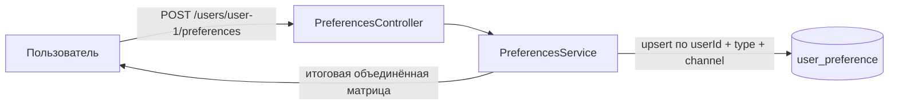
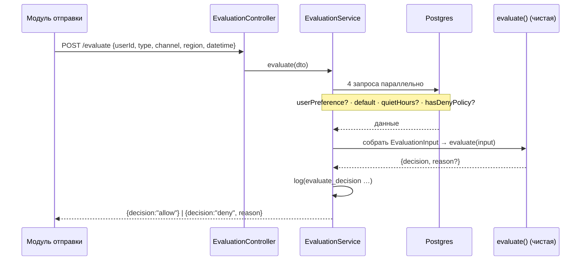

# Notification Preferences Service

 **Русский** | [English](README_ENG.md)

Единый источник правды о том, **можно ли отправить уведомление** пользователю по
конкретному каналу — с учётом его собственных настроек, системных дефолтов,
quiet hours (с учётом таймзоны) и глобальных политик.

Построено на **NestJS + TypeScript**, **PostgreSQL** через **Prisma**,
типизированная конфигурация через **@itgorillaz/configify**, тесты на **Jest**.

---

## Что делает сервис

Три зоны ответственности:

1. **Хранит** настройки — дефолты по (тип, канал), индивидуальные переопределения
   пользователя, quiet hours пользователя и глобальные политики.
2. **Предоставляет** API для чтения и изменения настроек пользователя.
3. **Принимает решение** — по входным данным об отправке возвращает `allow` / `deny`
   и причину.

---

## Как это работает (Dataflow)

По сути это **сервис-решатель**: он отвечает на один вопрос — «можно ли отправить
уведомление *типа X* по *каналу Y* пользователю *U* в регионе *R* в момент *T*?» →
`allow` / `deny` + причина. Сам он ничего не отправляет; хранение дефолтов,
настроек, quiet hours и политик существует только чтобы **накормить это решение**.

В решение складываются четыре источника данных:

| Источник | Кто владеет | Таблица | Пример (seed) |
|---|---|---|---|
| **Defaults** — базовая матрица для всех | платформа | `notification_default` | `MARKETING/EMAIL = off`, `TRANSACTIONAL/* = on` |
| **User preferences** — переопределения юзера | пользователь | `user_preference` | юзер выключил `MARKETING/PUSH` |
| **Quiet hours** — окно тишины | пользователь | `user_quiet_hours` | `22:00–08:00 Europe/Berlin` |
| **Global policies** — комплаенс-блоки | админ | `global_policy` | `MARKETING/SMS/EU = DENY` |

### Поток A — пользователь читает/меняет настройки



Запись — это **upsert** по уникальному ключу `(userId, notificationType, channel)`,
поэтому повторный одинаковый запрос ничего не ломает — это и есть идемпотентность.

### Поток B — модуль спрашивает «можно отправить?» (`/evaluate`)

Это сердце сервиса. Сервис делает I/O (грузит четыре куска данных **параллельно**),
затем отдаёт их **чистой функции** `evaluate()`, в которой ноль обращений к БД/Nest —
поэтому ядро логики тестируется без базы.



Порядок применения слоёв внутри `evaluate()` — см.
[Приоритет правил](#архитектура-и-ключевые-решения) (побеждает первый `deny`).

**Happy path по шагам** (новый `user-1`, ничего не настраивал, quiet hours нет):

- `TRANSACTIONAL / EMAIL / US` → политики нет → юзер не выключал → не marketing →
  дефолт `on` → **allow** ✅
- `MARKETING / EMAIL / US` → политики нет → юзер не выключал → marketing, но окна
  тишины нет → дефолт `off` → **deny: `disabled_by_default`** ✅

---

## Быстрый старт (Docker)

Требуется Docker + Docker Compose.

```bash
docker compose up --build
```

Поднимается PostgreSQL, затем контейнер сервиса, который **применяет миграции,
сидит дефолты + пример политики и запускает API** на
[http://localhost:3000](http://localhost:3000).

Проверка:

```bash
curl localhost:3000/health
# {"status":"ok"}
```

---

## Локальный запуск (без Docker)

Требуется Node.js 22+ и доступный экземпляр PostgreSQL.

```bash
# 1. Установить зависимости
npm install

# 2. Настроить окружение
cp .env.example .env
#   при необходимости отредактируйте DATABASE_URL под свой Postgres

# 3. Применить схему и засидить дефолты + пример политики
npm run prisma:migrate:dev      # создаёт/применяет миграции
npm run prisma:seed

# 4. Запустить
npm run start:dev
```

Ключи `.env`: `PORT`, `LOG_LEVEL`, `DATABASE_URL`. Configify валидирует их при
старте — отсутствующий `DATABASE_URL` или некорректный `PORT` прерывают запуск с
понятной ошибкой.

---

## Запуск тестов

```bash
# Unit-тесты — чистая доменная логика (движок решений, расчёт quiet hours). Без БД.
npm test

# End-to-end тесты — полный HTTP + Prisma против реального Postgres.
#   Требуется применённая миграция и засиженная БД (шаг 3 выше).
npm run test:e2e
```

Unit-тесты покрывают движок решений и логику таймзон/quiet hours в изоляции.
E2E-тесты прогоняют реальный HTTP API через Prisma и проверяют все пять
обязательных сценариев от начала до конца. E2E используют уникальные ID
пользователей в каждом кейсе и подчищают пользовательские строки после прогона;
засиженные дефолты и политики — только на чтение.

Каждый e2e-кейс следует схеме **Arrange → Act → Assert**: задать состояние
(`POST /users/:id/preferences`), спросить решение (`POST /evaluate`), проверить
точную пару `decision` / `reason`.

**Маппинг обязательных сценариев на тесты:**

| Сценарий из задания | Где проверяется |
|---|---|
| 1. Дефолты нового пользователя | `preferences.e2e` (GET нового), `evaluate.e2e` → `disabled_by_default` |
| 2. Пользователь меняет настройку | `evaluate.e2e` → `disabled_by_user_preference` |
| 3. Quiet hours | `evaluate.e2e` (marketing deny / transactional allow) + `quiet-hours.spec` |
| 4. Глобальная политика | `evaluate.e2e` → `blocked_by_global_policy` |
| 5. Идемпотентность | `preferences.e2e` (двойной POST → одинаковое состояние) |

---

## API

### `GET /users/:id/preferences`

Возвращает дефолты, объединённые с переопределениями пользователя (приоритет у
переопределений), каждое помечено своим `source`, плюс quiet hours.

```bash
curl localhost:3000/users/user-1/preferences
```

```json
{
  "userId": "user-1",
  "preferences": [
    { "notificationType": "MARKETING", "channel": "EMAIL", "enabled": false, "source": "default" },
    { "notificationType": "TRANSACTIONAL", "channel": "EMAIL", "enabled": true, "source": "default" }
  ],
  "quietHours": null
}
```

### `POST /users/:id/preferences`

Переключение настроек и/или установка quiet hours. Оба поля опциональны.
Идемпотентно. Возвращает итоговые объединённые настройки.

```bash
curl -X POST localhost:3000/users/user-1/preferences \
  -H 'content-type: application/json' \
  -d '{
    "preferences": [
      { "notificationType": "MARKETING", "channel": "EMAIL", "enabled": false }
    ],
    "quietHours": { "startTime": "22:00", "endTime": "08:00", "timezone": "Europe/Berlin" }
  }'
```

### `POST /evaluate`

Решает, разрешена ли отправка.

```bash
curl -X POST localhost:3000/evaluate \
  -H 'content-type: application/json' \
  -d '{
    "userId": "user-1",
    "notificationType": "MARKETING",
    "channel": "SMS",
    "region": "EU",
    "datetime": "2026-05-21T21:30:00Z"
  }'
```

```json
{ "decision": "deny", "reason": "blocked_by_global_policy" }
```

Возможные значения `reason`: `blocked_by_global_policy`,
`disabled_by_user_preference`, `quiet_hours`, `disabled_by_default`.

**Доменные значения**

- `channel`: `EMAIL`, `SMS`, `PUSH`, `MESSENGER`
- `notificationType`: `TRANSACTIONAL`, `MARKETING`
- `region`: `EU`, `US`, `APAC`, `OTHER`

---

## Архитектура и ключевые решения

**Разделение домена и инфраструктуры.** Движок решений и логика quiet hours
живут в `src/domain/` с **нулём** импортов NestJS или Prisma — они чистые,
детерминированные и покрыты unit-тестами в изоляции. Инфраструктурный слой
(`src/modules/`, `src/prisma/`) загружает данные через Prisma-репозитории и
передаёт их чистому движку.

```
src/domain/        чистая логика — типы, value object quiet hours, движок решений
src/modules/       контроллеры NestJS, сервисы, DTO, Prisma-репозитории
src/prisma/        PrismaService (синглтон) + глобальный модуль
src/config/        типизированная, валидируемая конфигурация (configify)
prisma/            схема, миграции, сид
```

**Приоритет правил.** `/evaluate` применяет слои в фиксированном порядке;
побеждает первый deny:

1. **Глобальная политика** по `(тип, канал, регион)` → `blocked_by_global_policy`
   (compliance hard-block — побеждает всё).
2. **Явный отказ пользователя** → `disabled_by_user_preference`.
3. **Quiet hours** (только маркетинговые типы, внутри окна пользователя) → `quiet_hours`.
4. **Эффективное состояние выключено** (переопределение пользователя, иначе дефолт) → `disabled_by_default`.
5. Иначе → `allow`.

Явное «вкл» пользователя перекрывает дефолтное «выкл», но всё ещё подчиняется
quiet hours и глобальной политике.

**Типы vs каналы.** Настройка ключуется по паре `(notificationType, channel)`.
`notificationType` — это семантическая категория (`TRANSACTIONAL` / `MARKETING`);
`channel` — способ доставки. Составные значения из примеров задания (например,
`marketing_email`) мапятся в `MARKETING` + `EMAIL`.

**Quiet hours и таймзоны.** Хранятся как локальные `HH:mm` начала/конца плюс
IANA-таймзона. При оценке входящий момент в UTC конвертируется в зону пользователя
через **Luxon** (корректно с учётом DST), а окно проверяется по правилу
«включительно начало / исключительно конец», с обработкой окон, переходящих через
полночь (например, 22:00–08:00). Транзакционные уведомления обходят quiet hours.

**Идемпотентность.** Изменения настроек и quiet hours — это декларативные `upsert`
по уникальным ключам, поэтому повторное применение той же команды даёт идентичное
состояние и никогда не дублирует строки.

**Дефолты.** Таблица `notification_default` сидится. У пользователя нет строк, пока
он что-то не переопределит; `GET` объединяет дефолты с переопределениями, так что
новый пользователь сразу видит корректные дефолты без единой записи.

---

## Observability

- Структурированные логи при каждом **изменении настроек** (`preference_changed`,
  `quiet_hours_changed`) и при каждом **решении evaluate** (`evaluate_decision` с
  user, type, channel, region, decision, reason). Без чувствительных данных.
- Точки вставки метрик помечены комментариями `// metric:` в местах принятия
  решений и изменения настроек, указывая, где инкрементировались бы счётчики/таймеры
  (например, `notifications_evaluated{decision,reason}`).

---

## Что бы я добавил перед продакшеном

- **AuthN/AuthZ** — сейчас сервис доверяет вызывающей стороне; нужно добавить
  межсервисную аутентификацию и авторизацию по пользователю.
- **Admin API** для управления глобальными политиками и дефолтами в рантайме
  (сейчас сидятся).
- **Метрики и трейсинг** — подключить помеченные точки метрик к
  Prometheus/OpenTelemetry.
- **Заголовок Idempotency-Key** для дедупликации команд поверх семантики upsert,
  плюс audit log изменений настроек.
- **Более богатые политики** — типы эффекта помимо DENY, конфигурируемое исключение
  из quiet hours по типу вместо захардкоженного правила «транзакционные обходят».
- **Более лёгкий Docker-образ** — multi-stage сборка с разделением build- и
  runtime-зависимостей.
- **Rate limiting** и трейсинг запросов на публичных эндпоинтах.
