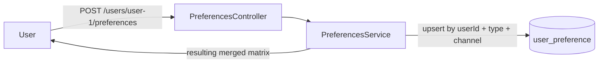
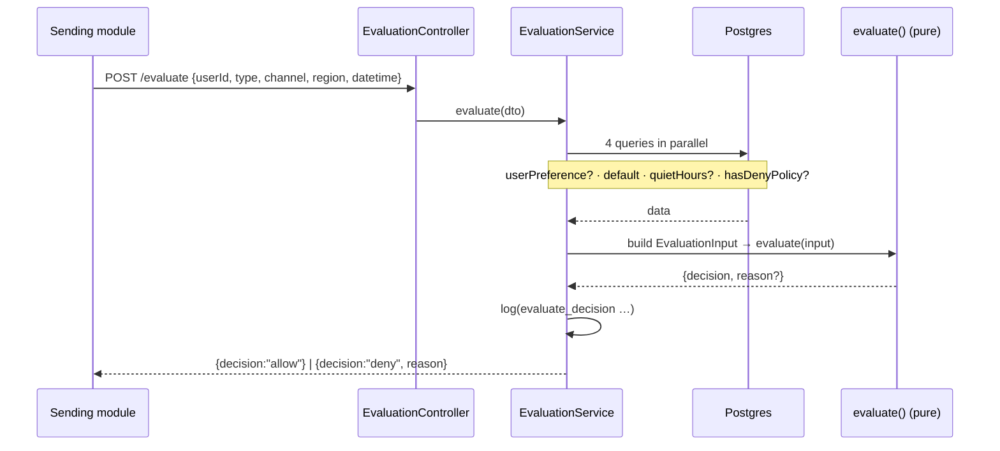

# Notification Preferences Service

 [Русский](README.md) | **English**

Single source of truth for **whether a notification may be sent** to a user on a
given channel — taking into account the user's own choices, system defaults,
quiet hours (timezone-aware), and global policies.

Built with **NestJS + TypeScript**, **PostgreSQL** via **Prisma**, typed config
via **@itgorillaz/configify**, and **Jest** for tests.

---

## What it does

Three responsibilities:

1. **Store** preferences — per-(type, channel) defaults, per-user overrides,
   per-user quiet hours, and global policies.
2. **Expose** an API to read and update a user's preferences.
3. **Decide** — given a send attempt, return `allow` / `deny` and a reason.

---

## How it works (Dataflow)

At its core this is a **decision service**: it answers one question — "may we send
a notification of *type X* over *channel Y* to user *U* in region *R* at moment
*T*?" → `allow` / `deny` + reason. It never sends anything; storing defaults,
preferences, quiet hours, and policies exists only to **feed that decision**.

Four data sources combine into the decision:

| Source | Owned by | Table | Example (seed) |
|---|---|---|---|
| **Defaults** — baseline matrix for everyone | platform | `notification_default` | `MARKETING/EMAIL = off`, `TRANSACTIONAL/* = on` |
| **User preferences** — the user's overrides | user | `user_preference` | user disabled `MARKETING/PUSH` |
| **Quiet hours** — the user's silence window | user | `user_quiet_hours` | `22:00–08:00 Europe/Berlin` |
| **Global policies** — compliance blocks | admin | `global_policy` | `MARKETING/SMS/EU = DENY` |

### Flow A — the user reads/changes preferences



A write is an **upsert** on the unique key `(userId, notificationType, channel)`,
so re-issuing the same request changes nothing — that is what makes it idempotent.

### Flow B — a module asks "may I send?" (`/evaluate`)

This is the heart of the service. It does I/O (loads four pieces of data **in
parallel**), then hands them to the **pure function** `evaluate()`, which has zero
DB/Nest access — so the core logic is testable without a database.



The order in which `evaluate()` applies the layers is in
[Decision precedence](#architecture--key-decisions) (the first `deny` wins).

**Happy path step by step** (new `user-1`, nothing configured, no quiet hours):

- `TRANSACTIONAL / EMAIL / US` → no policy → user didn't opt out → not marketing →
  default `on` → **allow** ✅
- `MARKETING / EMAIL / US` → no policy → user didn't opt out → marketing, but no
  silence window → default `off` → **deny: `disabled_by_default`** ✅

---

## Quick start (Docker)

Requires Docker + Docker Compose.

```bash
docker compose up --build
```

This starts PostgreSQL, then the service container which **applies migrations,
seeds defaults + a sample policy, and starts the API** on
[http://localhost:3000](http://localhost:3000).

Smoke test:

```bash
curl localhost:3000/health
# {"status":"ok"}
```

---

## Local setup (without Docker)

Requires Node.js 22+ and a reachable PostgreSQL instance.

```bash
# 1. Install dependencies
npm install

# 2. Configure environment
cp .env.example .env
#   edit DATABASE_URL if your Postgres differs from the default

# 3. Apply the schema and seed defaults + sample policy
npm run prisma:migrate:dev      # creates/applies migrations
npm run prisma:seed

# 4. Run
npm run start:dev
```

`.env` keys: `PORT`, `LOG_LEVEL`, `DATABASE_URL`. Configify validates these at
boot — a missing `DATABASE_URL` or bad `PORT` aborts startup with a clear error.

---

## Running tests

```bash
# Unit tests — pure domain logic (decision engine, quiet-hours math). No DB.
npm test

# End-to-end tests — full HTTP + Prisma against a real Postgres.
#   Requires a migrated + seeded database (steps 3 above).
npm run test:e2e
```

Unit tests cover the decision engine and timezone/quiet-hours logic in isolation.
E2E tests drive the real HTTP API through Prisma and assert the five required
scenarios end to end. E2E tests use unique user IDs per case and clean up
user-scoped rows afterward; seeded defaults and policies are read-only.

Each e2e case follows **Arrange → Act → Assert**: set state
(`POST /users/:id/preferences`), ask for a decision (`POST /evaluate`), assert the
exact `decision` / `reason` pair.

**Required scenarios mapped to tests:**

| Scenario from the task | Where it's verified |
|---|---|
| 1. Defaults for a new user | `preferences.e2e` (GET of a new user), `evaluate.e2e` → `disabled_by_default` |
| 2. User changes a preference | `evaluate.e2e` → `disabled_by_user_preference` |
| 3. Quiet hours | `evaluate.e2e` (marketing deny / transactional allow) + `quiet-hours.spec` |
| 4. Global policy | `evaluate.e2e` → `blocked_by_global_policy` |
| 5. Idempotency | `preferences.e2e` (double POST → identical state) |

---

## Swagger / OpenAPI

Once the service is running, interactive docs are available at:

- **Swagger UI** — [http://localhost:3000/docs](http://localhost:3000/docs)
- **OpenAPI JSON** — `http://localhost:3000/docs-json`

The UI is generated from the controllers' own metadata (`@nestjs/swagger`), so it
always matches the real routes: tags, paths, request/response schemas, and enum
values (`channel`, `notificationType`, `region`) are emitted automatically. You can
fire requests straight from the UI with **Try it out**.

The document covers every endpoint grouped by tag — `evaluate`, `preferences`,
`health`. The mount path is defined in `src/swagger/setup-swagger.ts`
(`SWAGGER_PATH`), and the document's correctness is asserted by the e2e test
`test/e2e/swagger.e2e-spec.ts`.

---

## API

### `GET /users/:id/preferences`

Returns defaults merged with the user's overrides (overrides win), each tagged
with its `source`, plus quiet hours.

```bash
curl localhost:3000/users/user-1/preferences
```

```json
{
  "userId": "user-1",
  "preferences": [
    { "notificationType": "MARKETING", "channel": "EMAIL", "enabled": false, "source": "default" },
    { "notificationType": "TRANSACTIONAL", "channel": "EMAIL", "enabled": true, "source": "default" }
  ],
  "quietHours": null
}
```

### `POST /users/:id/preferences`

Toggle preferences and/or set quiet hours. Both fields optional. Idempotent.
Returns the resulting merged preferences.

```bash
curl -X POST localhost:3000/users/user-1/preferences \
  -H 'content-type: application/json' \
  -d '{
    "preferences": [
      { "notificationType": "MARKETING", "channel": "EMAIL", "enabled": false }
    ],
    "quietHours": { "startTime": "22:00", "endTime": "08:00", "timezone": "Europe/Berlin" }
  }'
```

### `POST /evaluate`

Decide whether a send is allowed.

```bash
curl -X POST localhost:3000/evaluate \
  -H 'content-type: application/json' \
  -d '{
    "userId": "user-1",
    "notificationType": "MARKETING",
    "channel": "SMS",
    "region": "EU",
    "datetime": "2026-05-21T21:30:00Z"
  }'
```

```json
{ "decision": "deny", "reason": "blocked_by_global_policy" }
```

Possible `reason` values: `blocked_by_global_policy`,
`disabled_by_user_preference`, `quiet_hours`, `disabled_by_default`.

**Domain values**

- `channel`: `EMAIL`, `SMS`, `PUSH`, `MESSENGER`
- `notificationType`: `TRANSACTIONAL`, `MARKETING`
- `region`: `EU`, `US`, `APAC`, `OTHER`

---

## Architecture & key decisions

**Domain / infrastructure split.** The decision engine and quiet-hours logic
live in `src/domain/` with **zero** NestJS or Prisma imports — they are pure,
deterministic, and unit-tested in isolation. The infrastructure layer
(`src/modules/`, `src/prisma/`) loads data via Prisma repositories and feeds the
pure engine.

```
src/domain/        pure logic — types, quiet-hours VO, decision engine
src/modules/       NestJS controllers, services, DTOs, Prisma repositories
src/prisma/        PrismaService (singleton) + global module
src/config/        typed, validated configuration (configify)
prisma/            schema, migrations, seed
```

**Decision precedence.** `/evaluate` applies layers in a fixed order; the first
deny wins:

1. **Global policy** match `(type, channel, region)` → `blocked_by_global_policy`
   (compliance hard-block — wins over everything).
2. **Explicit user opt-out** → `disabled_by_user_preference`.
3. **Quiet hours** (marketing types only, inside the user's window) → `quiet_hours`.
4. **Effective state off** (user override, else default) → `disabled_by_default`.
5. Otherwise → `allow`.

An explicit user "on" overrides a default "off" but is still subject to quiet
hours and global policy.

**Types vs. channels.** A preference is keyed on the `(notificationType, channel)`
pair. `notificationType` is the semantic category (`TRANSACTIONAL` /
`MARKETING`); `channel` is the delivery medium. The task's composite example
values (e.g. `marketing_email`) map to `MARKETING` + `EMAIL`.

**Quiet hours & timezones.** Stored as local `HH:mm` start/end plus an IANA
timezone. Evaluation converts the inbound UTC instant to the user's zone using
**Luxon** (DST-correct) and tests the window with inclusive start / exclusive
end, handling windows that wrap past midnight (e.g. 22:00–08:00). Transactional
notifications bypass quiet hours.

**Idempotency.** Preference and quiet-hours updates are declarative `upsert`s on
unique keys, so re-applying the same command produces identical state and never
duplicates rows.

**Defaults.** A `notification_default` table is seeded. Users have no rows until
they override; `GET` merges defaults with overrides so a brand-new user shows the
correct defaults without any prior write.

---

## Observability

- Structured logs on every **preference change** (`preference_changed`,
  `quiet_hours_changed`) and every **evaluate decision** (`evaluate_decision`
  with user, type, channel, region, decision, reason). No sensitive payloads.
- Metric insertion points are marked with `// metric:` comments at the decision
  and update sites, indicating where counters/timers would be incremented (e.g.
  `notifications_evaluated{decision,reason}`).

---

## What I'd add before production

- **AuthN/AuthZ** — the service currently trusts the caller; add service-to-service
  auth and per-user authorization.
- **Admin API** for managing global policies and defaults at runtime (seeded today).
- **Metrics & tracing** — wire the marked metric hooks to Prometheus/OpenTelemetry.
- **Idempotency-Key** header for command de-duplication beyond upsert semantics,
  plus an audit log of preference changes.
- **Richer policies** — effect types beyond DENY, per-type quiet-hours exemption
  configuration instead of the hardcoded "transactional bypasses" rule.
- **Slimmer Docker image** — multi-stage build separating build and runtime deps.
- **Rate limiting** and request tracing on the public endpoints.
